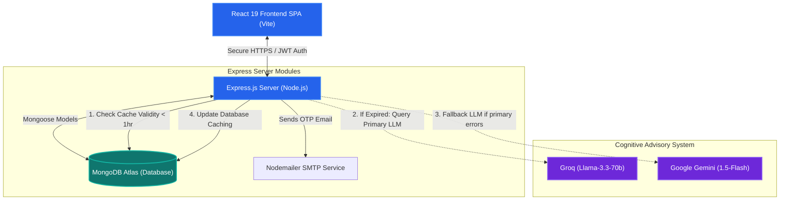

# 🤖 AI-Finance-Dashboard

[](LICENSE)
[](https://www.mongodb.com/mern-stack)
[](https://deepmind.google/technologies/gemini/)
[](https://groq.com/)
[](https://tailwindcss.com/)
[](https://react.dev/)

An advanced, **AI-powered MERN Personal Finance Dashboard** that simplifies smart expense tracking, interactive analytics, and provides personalized financial insights. Powered by a modern MERN stack, Tailwind CSS v4, and integrated with **Google Gemini & Groq AI** for intelligent financial advisory.

---

## 🎯 Table of Contents
1. [🚀 Core Features](#-core-features)
2. [🗺️ System Architecture](#%EF%B8%8F-system-architecture)
3. [🛠️ Technology Stack](#%EF%B8%8F-technology-stack)
4. [📂 Folder Structure](#-folder-structure)
5. [⚙️ Environment Configuration](#%EF%B8%8F-environment-configuration)
6. [🚀 Getting Started](#-getting-started)
7. [🔒 Security & Best Practices](#-security--best-practices)
8. [🤝 Contributing](#-contributing)
9. [📄 License](#-license)

---

## 🚀 Core Features

### 🔐 Secure Authentication Suite
*   **OTP-Verified Signups & Logins:** Safe onboarding powered by **Nodemailer** for email-based One-Time Password verification, keeping unverified accounts blocked.
*   **Interactive OTP Forms:** Dynamic user-friendly OTP input sheets with autofocus, resend timers, and robust error validation.
*   **Forgot Password Workflow:** Complete automated self-serve reset path using time-limited OTP tokens delivered securely to the user's inbox, with rules preventing password reuse.
*   **Robust Session Management:** Industry-standard **JSON Web Tokens (JWT)** with secure context-aware request headers, salted and hashed storage using **BcryptJS**.

### 📊 Dynamic Analytics Engine
*   **Comprehensive Financial Overview:** Real-time calculation of Total Income, Total Expenses, Net Savings, and Savings Rate percentages.
*   **Multi-Timeframe Filtering:** Seamlessly pivot transaction tables and visualization models between **Daily**, **Weekly**, and **Monthly** intervals.
*   **Real-time Comparative Analytics:** Dynamic visual indicators demonstrating transaction changes (percentage-based increase/decrease) against previous corresponding time frames.
*   **Custom Recharts Distribution:** Interactive SVG Pie Charts illustrating precise categorization breakdown for expenses, and modular custom Radial Gauges representing budget limits.

### 🤖 Cognitive AI Insights & Budget Advisory
*   **Dual LLM Engine Support:** Seamlessly integrated with **Groq SDK** (running `llama-3.3-70b-versatile`) as primary and **Google Generative AI** (running `gemini-1.5-flash`) as fallback/secondary advisory engine.
*   **Recent Trend Analysis:** Compiles and maps the last 30 days of actual user incomes and expenses into an optimized advisory prompt.
*   **Intelligent Database Caching:** Features a high-performance **1-hour sliding cache** (`lastInsightsDate` and `aiInsights` attributes stored on the user model) to minimize external API costs, reduce rate limiting, and boost dashboard loading speed.

### 💾 Seamless Data Export Utilities
*   **Excel Reporting:** Built-in integration with **SheetJS (XLSX)** generating download-ready spreadsheets of transaction histories containing formatted columns and metadata.
*   **CSV Stringify:** Clean native browser stream exports mapping raw databases into structured spreadsheets instantly.

### ✨ Premium UI/UX Ecosystem
*   **Tailwind CSS v4 & Dark Theme:** Immersive glassmorphic dark interface with fluid layouts and modern visual hierarchies.
*   **Interactive Particle Background:** Engaging custom canvas backgrounds powered by **tsParticles** and **react-tsparticles** that respond fluidly to mouse hover.
*   **3D Parallax Tilt Effects:** High-performance card scaling and rotating effects utilizing **Framer Motion** hooks (`useMotionValue`, `useSpring`, `useMotionTemplate`).
*   **Polished Scroll Transitions:** Smooth, orchestrated web page transitions and fade-ins powered by **GSAP** and Framer Motion.

---

## 🗺️ System Architecture

The following diagram illustrates the application's clean separation of concerns, API routes, and how the AI Cognitive engine interacts with caching:



---

## 🛠️ Technology Stack

| Stack Category | Technology Details | Purpose / Benefits |
| :--- | :--- | :--- |
| **Frontend Core** | React 19, Vite, React Router Dom v7 | Lightweight virtual DOM rendering, ultra-fast dev server |
| **Styling** | Tailwind CSS v4, Glassmorphism, CSS Variables | Sleek utility-first variables, unified themes, fully responsive |
| **Animations** | Framer Motion, GSAP, `@gsap/react` | Orchestrated timelines, interactive physics, 3D card tilt |
| **Visual Analytics**| Recharts (Pie, Cell, Legend, Tooltip) | Dynamic SVGs, responsive charts, crisp interactive tools |
| **Particle Background**| tsParticles, react-tsparticles | Stunning dark-mode canvas interaction |
| **Backend Core** | Node.js, Express.js | Modular, high-concurrency controller-route architecture |
| **Database** | MongoDB Atlas, Mongoose | Schema validation, NoSQL flexibility, indexed user relations |
| **Security** | JSON Web Tokens (JWT), BcryptJS, Validator | Salted-hash storage, route guard middleware, input cleaning |
| **AI Integration** | `groq-sdk`, `@google/generative-ai` | Natural language expert financial advisor models |
| **Email Server** | Nodemailer | Transactional email transmission for verification/reset |
| **Reports** | SheetJS (XLSX), CSV Stringify | Client-side spreadsheet formatting and instant download |

---

## 📂 Folder Structure

```text
AI-Finance-Dashboard/
├── Frontend/                 # React 19 Frontend SPA
│   ├── src/
│   │   ├── assets/           # Tailored stylesheets, color configurations, visual theme variables
│   │   ├── components/       # Reusable components (AddModal, AiInsights, FinancialCard, OTPForms)
│   │   │   ├── ForgotPassword.jsx  # Handles OTP validation and password resets
│   │   │   ├── Tilt.jsx            # Custom 3D Parallax Tilt hover wrapper
│   │   │   └── ...
│   │   ├── pages/            # Core views (Dashboard, Income, Expense, Profile)
│   │   ├── utils/            # Helper modules (exportCsv, exportUtils, API base configs)
│   │   ├── App.jsx           # Application Router and Global Context bindings
│   │   ├── index.css         # Tailwind directives and customized class bindings
│   │   └── main.jsx          # React SPA entry point
│   ├── package.json          # Frontend development dependencies
│   └── vite.config.js        # Vite compiler with Tailwind CSS v4 plugin
│
├── backend/                  # Express REST API
│   ├── config/               # Database and API connector initializers (db.js)
│   ├── controllers/          # Core route controllers (user, income, expense, ai, dashboard)
│   │   ├── aiController.js   # Dynamic insight logic with LLM switches & database caching
│   │   ├── userController.js # Signup, Login, Password Reset, OTP validators
│   │   └── ...
│   ├── middleware/           # Route guard middlewares (JWT validations)
│   ├── models/               # MongoDB models (userModel, incomeModel, expenseModel)
│   ├── routes/               # Modular API routes (userRoute, aiRoute, incomeRoute, expenseRoute)
│   ├── scripts/              # Local development & testing utilities (seed scripts)
│   ├── utlis/                # SMTP / Nodemailer helper libraries (mail.js)
│   ├── server.js             # API entrance point & middleware initialization
│   ├── package.json          # Node server dependencies
│   └── vercel.json           # Production cloud host deployments
│
├── LICENSE                   # MIT License
└── README.md                 # Project Walkthrough & Documentation
```

---

## ⚙️ Environment Configuration

To launch this application locally, you must configure target configuration files for both the **Frontend** and the **Backend**.

### 1. Backend Setup (`backend/.env`)
Create a `.env` file inside the `/backend` directory and add the following keys:
```env
PORT=5000
MONGO_URI=your_mongodb_atlas_connection_string
JWT_SECRET=your_super_secret_jwt_sign_key

# --- AI API Keys ---
GEMINI_API_KEY=your_google_gemini_api_key
GROQ_API_KEY=your_groq_api_key

# --- Nodemailer SMTP Configuration ---
EMAIL=your_nodemailer_sender_email@gmail.com
EMAIL_PASSWORD=your_gmail_app_password
```

> [!IMPORTANT]
> For Gmail Nodemailer SMTP configurations, you **must** use an **App Password** rather than your actual login password. Go to **Google Account -> Security -> 2-Step Verification -> App Passwords** to generate one.

### 2. Frontend Setup (`Frontend/.env`)
Create a `.env` file inside the `/Frontend` directory:
```env
VITE_API_URL=http://localhost:5000/api
```

---

## 🚀 Getting Started

### Prerequisites
*   Node.js (v18 or higher recommended)
*   A running MongoDB Database instance (local or MongoDB Atlas cloud cluster)
*   Gemini API Key and/or Groq API Key

### Step 1: Clone the Repository
```bash
git clone https://github.com/manavsharma111/AI-Finance-Dashboard.git
cd AI-Finance-Dashboard
```

### Step 2: Launch the Backend Server
1. Navigate to the backend folder:
   ```bash
   cd backend
   ```
2. Install the production and development dependencies:
   ```bash
   npm install
   ```
3. Set up your `.env` variables as outlined in the [Environment Setup](#1-backend-setup-backendenv).
4. *(Optional)* Seed a verified test user for local validation:
   ```bash
   npm run seed:test-user
   ```
5. Launch the live-reload development server:
   ```bash
   npm run dev
   ```

### Step 3: Launch the Frontend App
1. Open a new terminal and navigate to the Frontend folder:
   ```bash
   cd ../Frontend
   ```
2. Install the frontend modules:
   ```bash
   npm install
   ```
3. Configure the `.env` API variable as outlined in the [Environment Setup](#2-frontend-setup-frontendenv).
4. Launch the local Vite server:
   ```bash
   npm run dev
   ```
5. Open your browser and navigate to `http://localhost:5173`.

---

## 🔒 Security & Best Practices
*   **Bcrypt Password Cryptography:** Raw user passwords are salted and hashed on the backend before being written to the database.
*   **Strict JWT Route Guarding:** Sub-routing guards filter headers, parsing JWT structures to verify permissions before allowing reads or edits of finance logs.
*   **NoSQL Injection Safeguards:** Input parameters are audited using `validator` libraries to prevent Mongoose schema vulnerabilities.
*   **Secure Password Changes:** Passwords cannot be reset to the user's current password. Strength validation enforces a minimum of 8 characters, capital letters, numbers, and special symbols.

---

## 🤝 Contributing
Contributions make the open-source community an amazing place to learn, inspire, and create. Any contributions you make are **greatly appreciated**.

1. Fork the Project
2. Create your Feature Branch (`git checkout -b feature/AmazingFeature`)
3. Commit your Changes (`git commit -m 'Add some AmazingFeature'`)
4. Push to the Branch (`git push origin feature/AmazingFeature`)
5. Open a Pull Request

---

## 📄 License
Distributed under the MIT License. See [LICENSE](LICENSE) for more information.
